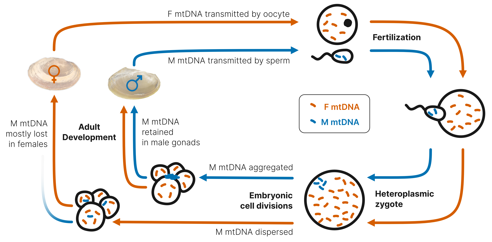
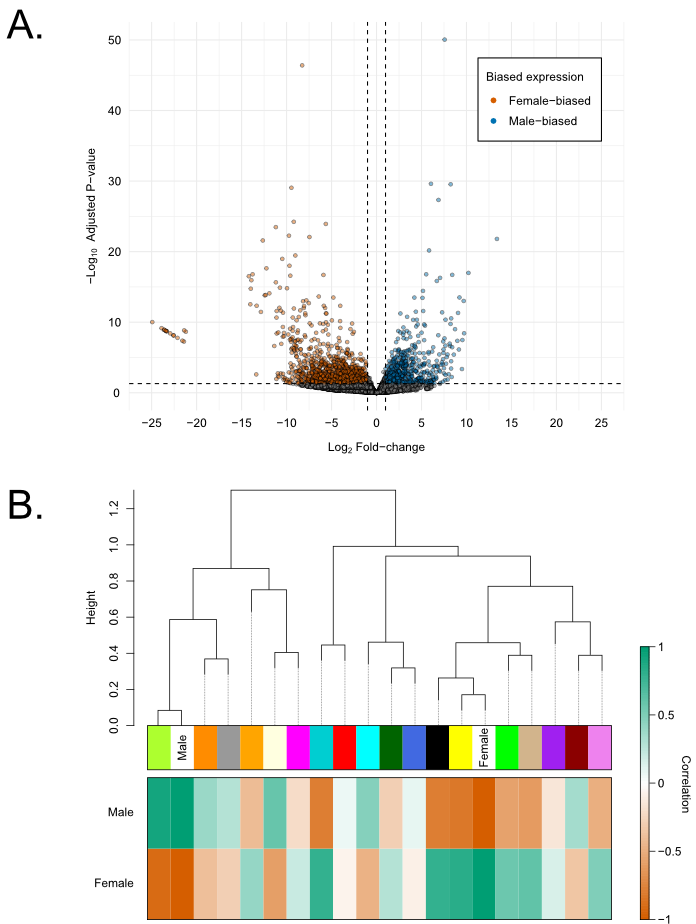
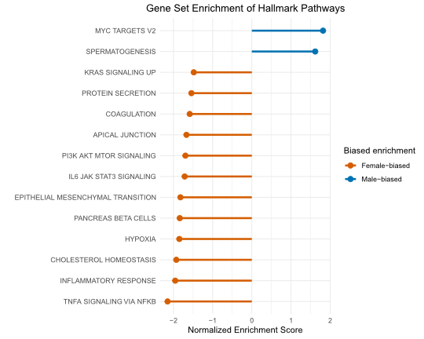
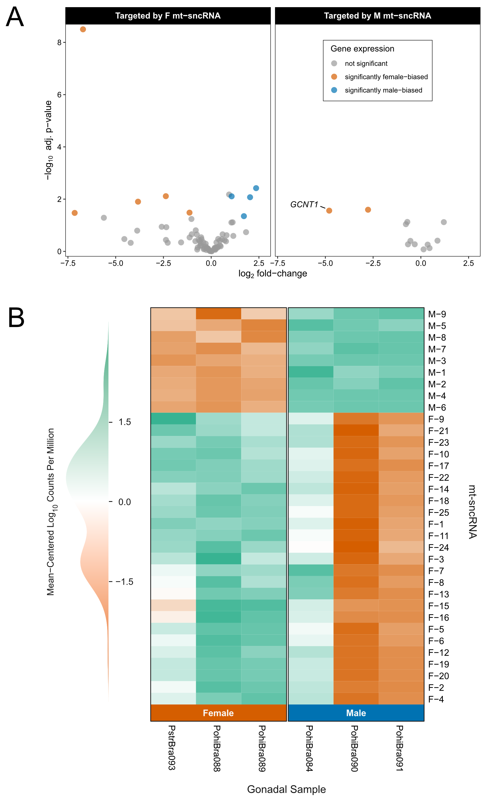
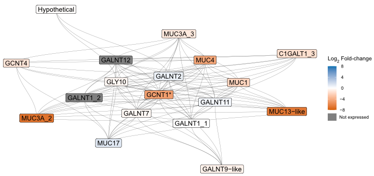

# Mitonuclear sex determination in freshwater mussels

This project investigates the role of mitochondrial DNA in the sex determination of freshwater mussels with doubly uniparental mitochondrial inheritance. 

## Analyses 
This repository hosts scripts for the following analyses:

-   differential gene expression (`DESeq2`)

-   weighted gene co-expression network analysis (`WGCNA`)

-   gene set enrichment analysis (`GSEA`)

-   protein-protein interaction prediction (AlphaFold & AlphaPulldown)

-   mitochondrial short-non coding RNA validation

Analyses were performed by running `analysis_workflow.R`, and results were synthesized into the visualizations presented below. 
   

## Data visualizations
 

  
**Figure 1.** Overview of doubly uniparental mitochondrial inheritance in bivalves. Adapted from Breton et al. (2018). 
   
 

   
**Figure 2.** A) Volcano plot representing differential gene expression across female and male gonadal samples of *Potamilus streckersoni.* B) Dendrogram of modules from a weighted gene co-expression network. Heat map visualizes the correlation between the eigengene of each module and whether the gonadal sample is female or male. 
   
 

     
**Figure 3.** Gene set enrichment of Hallmark Pathways. Pathways with negative NES values contain genes with female-biased expression, while pathways with positive NES values contain genes with male-biased expression. All shown pathways showed significant enrichment (p-adj < 0.05) in female (orange) and male (blue) gonadal tissue.  
   
   

     
**Figure 4.** A) Volcano plots highlighting the differential expression of genes that are targeted by F and M mitochondrial short non-coding RNAs (mt-sncRNAs). B) Heat map visualizes sncRNAs expressed from mitochondria that were isolated from female and male gonadal samples. The log10 counts per million of each mt-sncRNA are mean-centered, such that a sample with average expression is represented in white.
   
   

     
**Figure 5.** GCNT1 protein network as predicted by STRING based on the *Potamilus streckersoni* proteome. Gray lines represent known interactions based on database and experimental evidence. Genes are colored based on expression profiles between female (orange) and male (blue) gonadal tissue with density representing higher differences in gene expression between female and male gonadal tissue. Dark gray coloration represents genes with no expression. Asterisks indicated genes with significant differences in expression (p-adj < 0.05). Protein names with the suffix ‘-like’ are hypothetical and annotated as their best KEGG-hit when applicable. Protein names with an underscore represent protein products from genes with multiple annotated copies. 