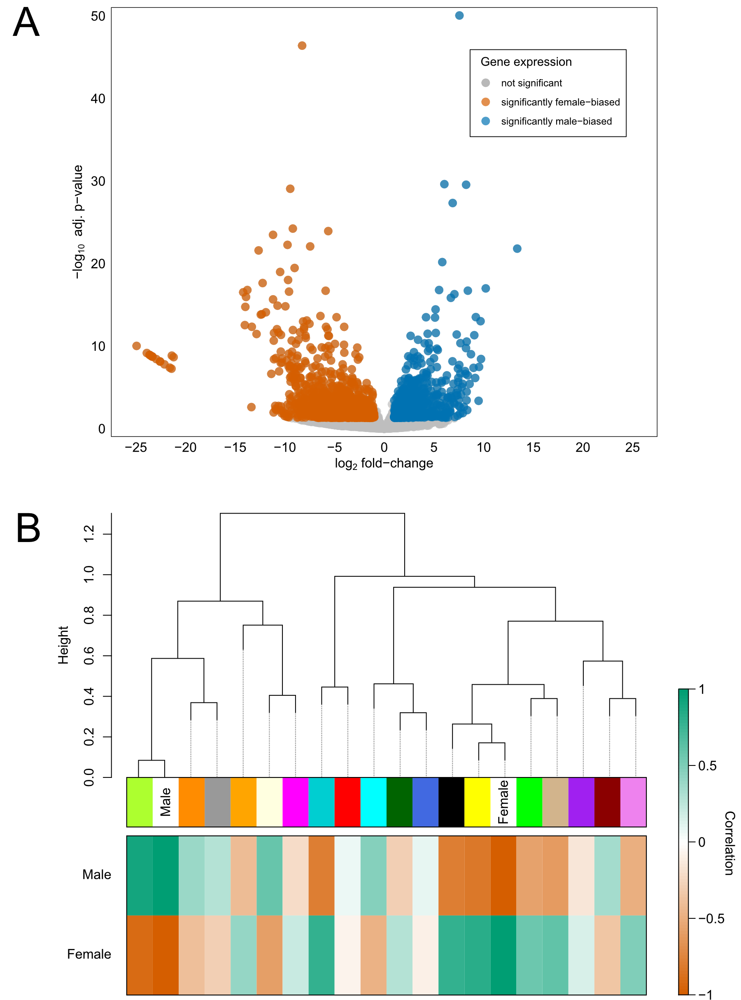

# Mitonuclear sex determination in freshwater mussels

This project investigates the role of mitochondrial DNA in the sex determination of freshwater mussels with doubly uniparental mitochondrial inheritance. This repository hosts scripts for the following analyses:

-   differential gene expression (`DESeq2`)

-   weighted gene co-expression network analysis (`WGCNA`)

-   gene set enrichment analysis (`GSEA`)

-   protein-protein interaction prediction (AlphaFold & AlphaPulldown)

-   mitochondrial short-non coding RNA validation

   

## Data visualizations
 

 **Figure 1.** Overview of doubly uniparental mitochondrial inheritance in bivalves. Adapted from Breton et al. (2018).    

 **Figure 2.** A) Volcano plot representing differential gene expression across female and male gonadal samples of *Potamilus streckersoni.* B) Dendrogram of modules from a weighted gene co-expression network. Heat map visualizes the correlation between the eigengene of each module and whether the gonadal sample is female or male.    

 **Figure 4.** A) Volcano plots highlighting the differential expression of genes that are targeted by F and M mitochondrial short non-coding RNAs (mt-sncRNAs). B) Heat map visualizes sncRNAs expressed from mitochondria that were isolated from female and male gonadal samples. The log10 counts per million of each mt-sncRNA are mean-centered, such that a sample with average expression is represented in white.
